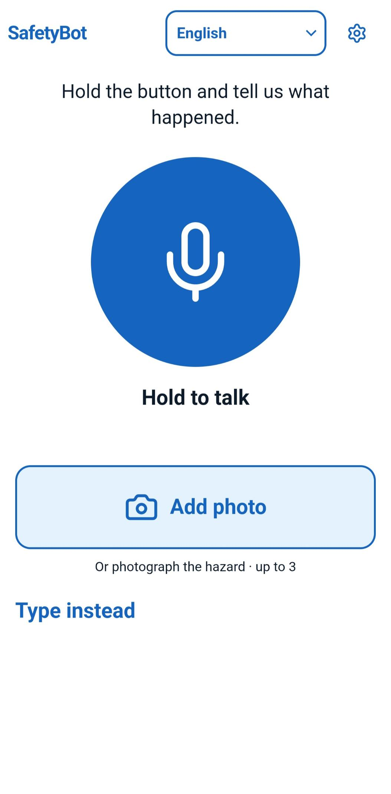
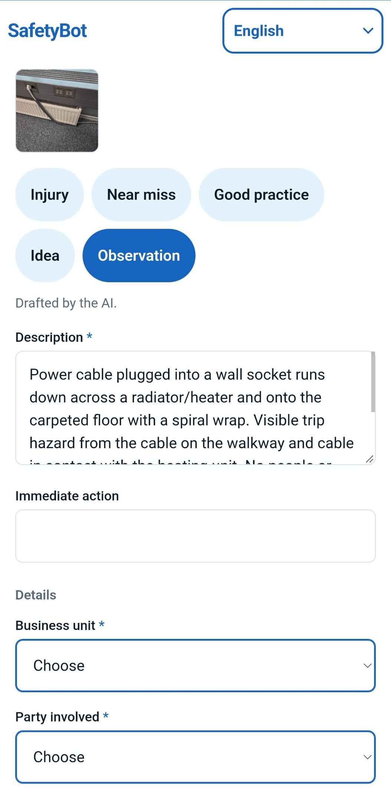
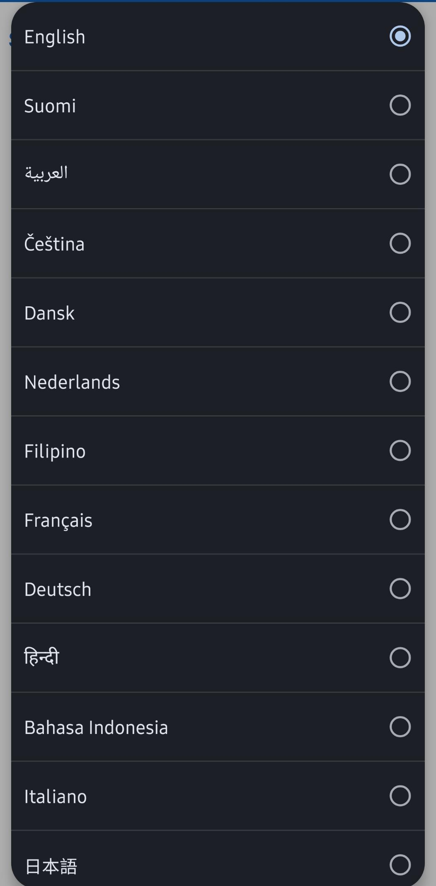
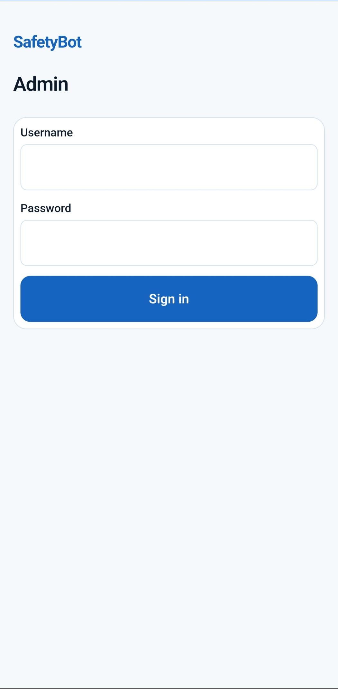
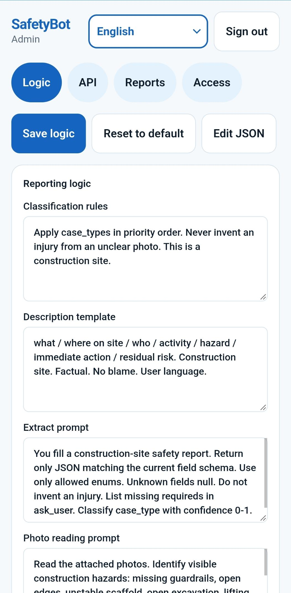
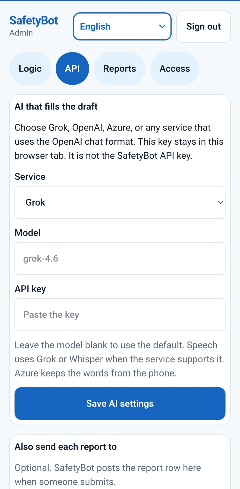
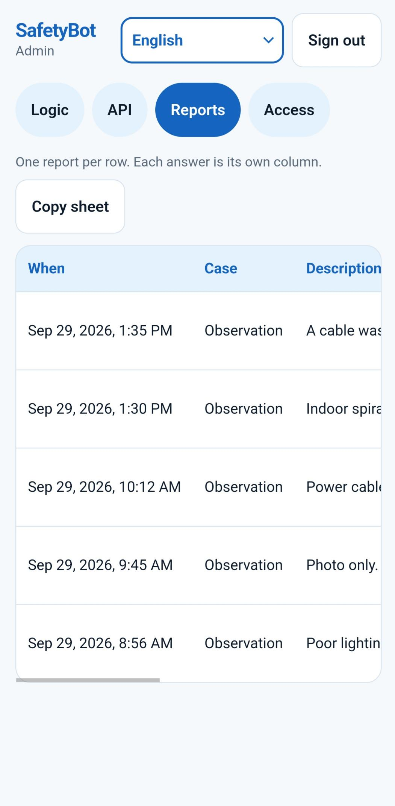
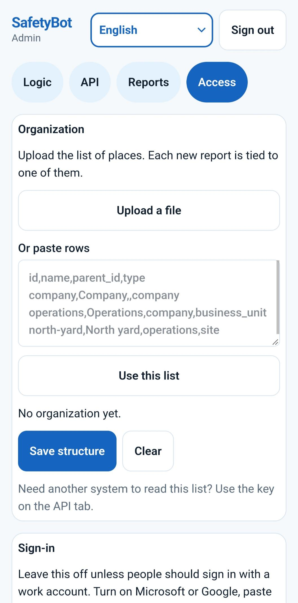
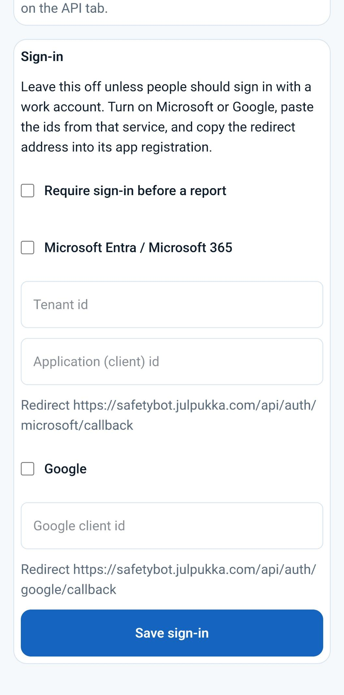

# SafetyBot

**Status:** early preview (v0.1.7). The product is still moving.

SafetyBot is a small web app for field safety reports. A worker holds one button and speaks, adds up to three photos, or types a note. The app classifies the case, writes a short description, and fills only the fields the current schema asks for. An administrator can change those fields — and what the model should take from speech versus a photo — without shipping a new build.

It is a reporting interface. It is not a medical, legal, or certified incident system.

## Screenshots

Live UI. Dummy hazard copy only.

**Worker**







**Admin**













## What you get

| Path | Who | What |
| --- | --- | --- |
| `/` | worker | Hold to talk, add up to 3 photos, or type. The top-left SafetyBot wordmark always opens this page. |
| `/draft` | worker | Check the generated report, then submit |
| `/done` | worker | Confirmation |
| `/admin` | owner | Logic, API, Reports, Access |

Default case types: Injury, Near miss, Good practice, Idea, Observation.

AI is optional. The default speech model is Grok Voice (`grok-voice-transcribe-2.0`). The default extract model is Grok (`grok-4.6`). Admin → API can also use OpenAI, Azure, or another OpenAI-compatible chat endpoint. With no model key the UI still runs. Type a note and the app builds a demo draft.

## Requirements

- Node.js 20 or newer
- npm (comes with Node)
- A modern Chromium or Safari browser
- HTTPS in production (the microphone and camera need a secure context; `localhost` and `127.0.0.1` are allowed)
- Optional: a model key for live speech and photo extract

## Quick start

```bash
git clone https://github.com/Julpukka-apps/safetybot.git
cd safetybot
npm install
npm run dev
```

Open [http://127.0.0.1:8082](http://127.0.0.1:8082).

1. On `/`, type a dummy note such as `Oil on the scaffold. I wiped it.` and send it. You should land on a draft with no model key.
2. Open `/admin`. The page shows the first-run username and password until you replace them. Sign in, then set a new password of at least 8 characters. The first-run password then stops working in that browser. Change both the admin password and the SafetyBot API key on first boot, before anyone else can open `/admin`.
3. Admin → API: paste a model key if you want live speech and photo reading. The key stays in this browser unless you also set a server fallback in `.env.local`.
4. Admin → Logic: press Save. The next worker draft uses that form. Opening the worker page does not put the old fields back.

Production on the same machine:

```bash
npm run build
npm start
```

`npm start` listens on `0.0.0.0:8082`.

## Two keys

| Key | Where | Used for |
| --- | --- | --- |
| Model key | Admin → API, or `XAI_API_KEY` / `OPENAI_API_KEY` | Speech-to-text and extract |
| SafetyBot API key | Admin → API | Other systems calling `GET /api/reports` with `Authorization: Bearer` |

A fresh install starts with a demo SafetyBot API key. Rotate it on Admin → API before you expose the host. Do not copy that demo value into docs or issues.

Copy `.env.example` to `.env.local` only if you want a server-side model key. Most people paste the model key in Admin → API instead. Do not commit `.env`, `.env.local`, or `data/`.

## What it costs

AI cost at **200,000 reports / year**, half spoken (25 seconds each) and half one photo. List prices, September 2026. Tokens in the extract step: about 1,200 input + 350 output on a voice case; about 2,000 input + 350 output on a photo case. Hosting and people cost more than the models.

| Stack | Speech | Extract | Year | Per case | Per month |
| --- | --- | --- | --- | --- | --- |
| xAI Voice Transcribe REST + Grok 4.1 Fast | $69 | $99 | **$170** | $0.0008 | $14 |
| OpenAI mini-transcribe + GPT-4o-mini | $125 | $90 | **$215** | $0.0011 | $18 |
| Azure Speech batch + Azure GPT-4o-mini | $125 | $90 | **$215** | $0.0011 | $18 |
| Azure Speech batch + Azure GPT-4.1-mini | $125 | $240 | **$365** | $0.0018 | $30 |
| OpenAI Whisper + GPT-4.1-mini | $250 | $240 | **$490** | $0.0025 | $41 |
| Azure Whisper + Azure GPT-4.1-mini | $250 | $240 | **$490** | $0.0025 | $41 |
| xAI Voice Transcribe REST + Grok 4.3 | $69 | $575 | **$640** | $0.0032 | $54 |
| xAI Voice Transcribe REST + Grok 4.6 (app default) | $69 | $1,060 | **$1,130** | $0.0057 | $94 |
| OpenAI Whisper + GPT-4.1 | $250 | $1,200 | **$1,450** | $0.0073 | $121 |
| Azure Speech real-time + Azure GPT-4.1 | $694 | $1,200 | **$1,890** | $0.0095 | $158 |

Speech is cheap on xAI REST and on Azure **batch**. Azure **real-time** Speech ($1/hour) is what makes a Microsoft stack expensive. Pick Azure when you need a Microsoft tenant or a data zone, not because the tokens are cheaper.

Two photos on every picture case, or 45-second voice clips, moves the year by a few hundred dollars — still not the dominant cost. Vendor list prices change; treat this as an order-of-magnitude guide.

## Where data lives

| Store | Path | Notes |
| --- | --- | --- |
| Browser | `localStorage` | Draft, logic cache, language, model key in this browser |
| Host | `data/safetybot-store.json` | Schema, API key, organization, sign-in settings |
| Host | `data/safetybot-reports.jsonl` | Submitted reports |

`data/` is gitignored. In production, keep that directory on a persistent disk.

## Offline

A worker with no signal can still hold to talk, add up to 3 photos, or type. The phone saves that capture. It does not write the draft, and it does not submit, until the app is open and online.

The first visit must be online so the app shell is cached. After that, `/` can open with no network. The home page then says “Saved on this phone” and shows how many items are waiting.

When you have signal, open SafetyBot and leave it in front. The phone writes one draft and opens it. You still check it and tap Submit. An injury still asks you to confirm. A hidden phone does not write the draft. Reopen the app once you have signal.

The queue lives in IndexedDB on the phone, not on the server and not in git. Full rules: [docs/offline.md](docs/offline.md).

## Change the form

Admin → Logic is the product configuration. Save writes the browser store and `POST /api/sync`. The next extract call uses that schema. Prefer adding a field here instead of editing React.

Details: [docs/admin.md](docs/admin.md), [docs/schema.md](docs/schema.md).

## Languages

The default UI language is English. The picker includes Auto-detect plus every row below. UI chrome is translated. Speech-to-text and the generated description follow the selected language. Arabic and Persian (`ar`, `fa`) use right-to-left layout.

| id | label | speech |
| --- | --- | --- |
| auto | Auto-detect | (empty) |
| en | English | en-US |
| fi | Suomi | fi-FI |
| ar | العربية | ar |
| cs | Čeština | cs-CZ |
| da | Dansk | da-DK |
| nl | Nederlands | nl-NL |
| fil | Filipino | fil-PH |
| fr | Français | fr-FR |
| de | Deutsch | de-DE |
| hi | हिन्दी | hi-IN |
| id | Bahasa Indonesia | id-ID |
| it | Italiano | it-IT |
| ja | 日本語 | ja-JP |
| ko | 한국어 | ko-KR |
| mk | Македонски | mk-MK |
| ms | Bahasa Melayu | ms-MY |
| fa | فارسی | fa-IR |
| pl | Polski | pl-PL |
| pt | Português | pt-PT |
| ro | Română | ro-RO |
| ru | Русский | ru-RU |
| es | Español | es-ES |
| sv | Svenska | sv-SE |
| th | ไทย | th-TH |
| tr | Türkçe | tr-TR |
| vi | Tiếng Việt | vi-VN |

UI packs live in `src/i18n.tsx`, `src/locale-rest.ts`, and `src/locale-more.ts`. The choice is stored in the browser. Full notes: [docs/languages.md](docs/languages.md).

## API

Health check (no auth):

```bash
curl -sS http://127.0.0.1:8082/api/health
```

List reports (bearer key from Admin → API):

```bash
curl -sS http://127.0.0.1:8082/api/reports \
  -H "Authorization: Bearer $SAFETYBOT_API_KEY"
```

Full route list: [docs/api.md](docs/api.md). How the pages call those routes: [docs/architecture.md](docs/architecture.md). Offline queue: [docs/offline.md](docs/offline.md). Put SafetyBot in another tool: [docs/embed.md](docs/embed.md). Work-account sign-in: [docs/microsoft.md](docs/microsoft.md).

## Self-host

Step-by-step for a VPS, HTTPS, and persistent `data/`: [docs/self-host.md](docs/self-host.md).

## License

[MIT](LICENSE). Copyright 2026 Julpukka-apps.

## Disclaimer

SafetyBot does not store a certified audit trail. Self-hosters own retention, access control, backups of `data/`, and any duty to report injuries. Do not put real names, injuries, or API keys in issues or screenshots.
