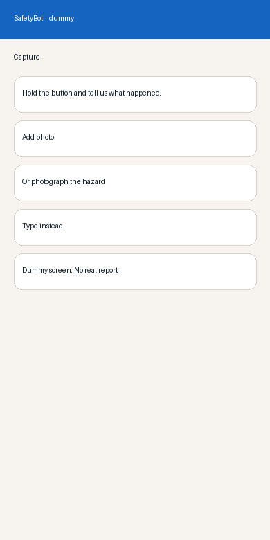
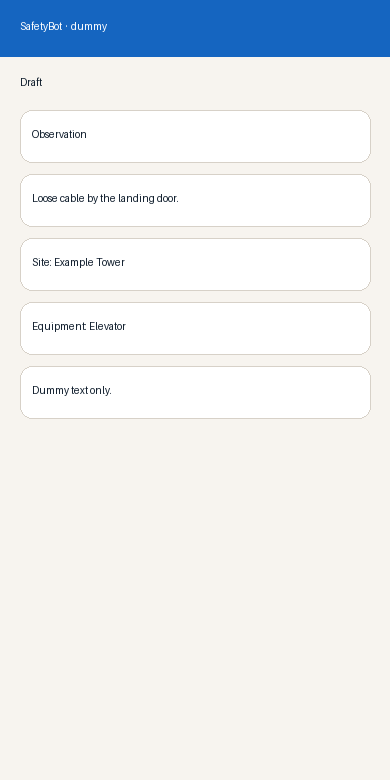
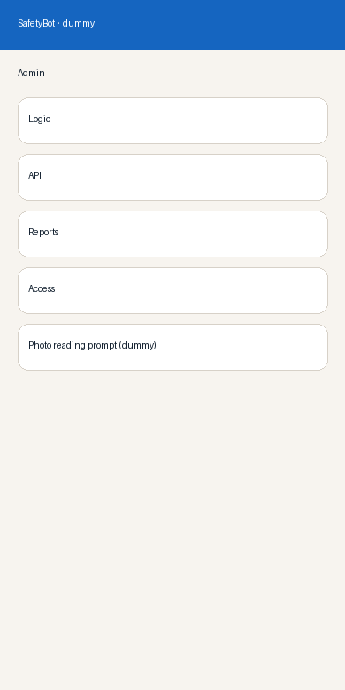

# SafetyBot

**Work in progress.** The app is still under development. This repository is private.

Live preview: https://safetybot.julpukka.com

A worker can hold the mic, type, or photograph a hazard. The draft opens from that capture. Admin edits the report logic, including the photo reading prompt.

## Run

```bash
npm install
npm run dev
```

`npm run dev` serves http://127.0.0.1:8082. Production is `npm run build` then `npm start`, which listens on `0.0.0.0:8082`.

Copy `.env.example` to `.env.local` only if you need a server-side model key. Do not commit that file. Do not commit `data/`.

## Admin

Open `/admin`. Tabs are Logic, API, Reports, and Access. See [docs/admin.md](docs/admin.md).

## Docs

- [Admin](docs/admin.md)
- [API](docs/api.md)
- [Schema](docs/schema.md)
- [Contributing](CONTRIBUTING.md)
- [Security](SECURITY.md)

## Screenshots

Dummy screens only. Not live reports.






